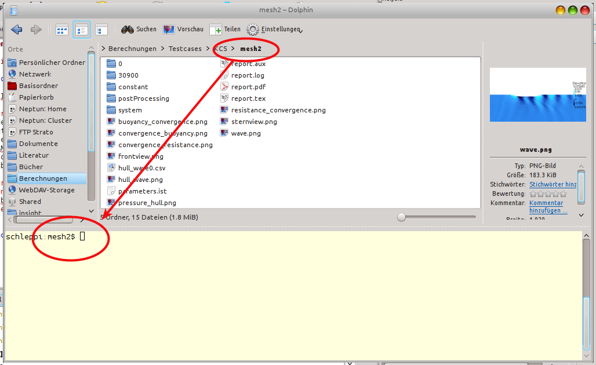
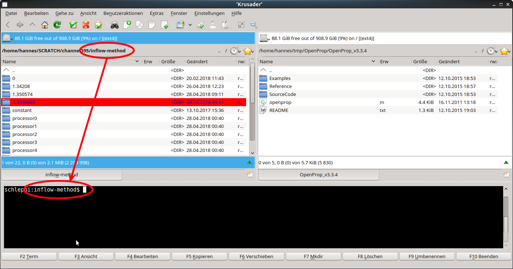

# License and Copyright

InsightCAE is free software; you can redistribute it and/or modify it under the terms of version 2 of the GNU General Public License[^1] as published by the Free Software Foundation. You accept the terms of this license by distributing or using this software.

This manual is Copyright (c) 2017-2026 silentdynamics GmbH.

Permission is granted to copy, distribute and/or modify this document under the terms of the GNU Free Documentation License, Version 1.3 or any later version published by the Free Software Foundation; with no Invariant Sections, no Front-Cover Texts, and no Back-Cover Texts. A copy of the license is included in the section entitled "GNU Free Documentation License".

# About InsightCAE

InsightCAE is a framework for building automated analysis and design workflows in Computer-Aided Engineering with a preference for open source tools.

Individual open source projects often meet only subtasks in an analysis process and have very different APIs. To conduct computational tasks, a combination of several software tools is often required. In order to use open source software productive and efficient for everyday tasks, the analysis automation framework InsightCAE was created.

InsightCAE serves as a framework for the implementation of analysis procedures. The objective is to provide adapters and interfaces to the tools and simulation programs that are needed for a specific computing task.

Some common use cases are:

- create a simulation app InsightCAE’s toolkit library is used to build a simulation app. The workbench or the web interface can be used to present the parameter form to the user and display a 3D preview of the setup. The app generates a result set. InsightCAE contains a viewer to display result sets or compare data from different result sets. The simulation app can be stored in a custom library or in a python script.
- assist in creation of OpenFOAM cases InsightCAE contains a GUI (called "Case Builder") to build OpenFOAM cases by putting features together into an OpenFOAM case.
- build parametric, script-based CAD models InsightCAE contains an interpreter for script-based CAD models. The underlying CAD kernel is OpenCASCADE (a BREP kernel). This utilized to produce geometry in the course of optimizations, for example.

# Contributors

The following people have so far contributed to InsightCAE:

- Hannes Kröger (silentdynamics GmbH)
- Johann Turnow (silentdynamics GmbH)

If you want to get involved in the development, please feel invited to do so! We greatly appreciate any contribution and we would very much like to add you to the above list.

If you made some modification or addition to the code, which you would like to be merged into the main development line, please consider to send us a pull request.

# Features and Highlights

InsightCAE’s objective is to create automated analysis workflows. The high level API resides in the core "toolkit" library. Automated workflows usually involve different external programs and utilities. For the realization of automated workflows, it is sometimes required, to create add-ons to these external programs. Thus InsightCAE is also a container for add-ons to other programs.

* InsightCAD script-based, fully parametric CAD
    * OpenCASCADE geometry kernel
    * assemblies, constraint-based sketches, part library, drawing export
* OpenFOAM add-ons (schemes, boundary conditions, models, ...)
* Pre- & Postprocessing tool (OpenFOAM Case Builder)
* analysis workflow automation tools (GUI)

# Sources of Information

## In the Web

- Source Code Repository [at GitHub](https://github.com/hkroeger/insightcae)
- Issue Tracker [at GitHub](https://github.com/hkroeger/insightcae/issues)
- Web Forum [at Google Groups](https://groups.google.com/forum/#!forum/insightcae)

## Reporting Bugs and Feature Requests

Please use the [issue tracker](https://github.com/hkroeger/insightcae/issues) to report any bugs.

We also monitor the [web forum](https://groups.google.com/forum/#!forum/insightcae) for questions or feature requests.

## Getting Professional Help and Support

Beyond the web resources above, [silentdynamics GmbH](https://silentdynamics.de) offers commercial support for professional users of InsightCAE. Automated analyses according to customer needs and specifications are implemented by creating new specialized modules for Insight CAE. Typical support contracts include also user training and continuous customization and updating of InsightCAE and its add-ons.

# Recommendations for Working with Shell-based Tools in Linux

Sometimes it is necessary to execute tools in a bash shell, e.g. because no GUI for it is available. And often it is easier to keep an overview in graphical file manager. Having a console window open together with a file manager window at the same time is an obvious solution but to do so for many cases at a time may easily confuse the desktop.

Here are two useful hints to solve this issue:

1. The KDE file manager **dolphin** offers the possibility to display a console in the lower half of the window. The working directory is synchronized with the directory shown in the graphical window by injection of **cd** commands. Vice versa, when the working directory is changed in the shell, the graphical display is updated as well.

    {#fig:dolphin}

2. There is a Norton-Commander-like file manager named **krusader**. It offers the same functionality regarding the embedded terminal but a more flexible way of displaying multiple folders. In addition to the two list view on the left and right, multiple tabs for folders can be added in each list view. And there is also a rich interface to define custom commands and file associations.

{#fig:krusader}
