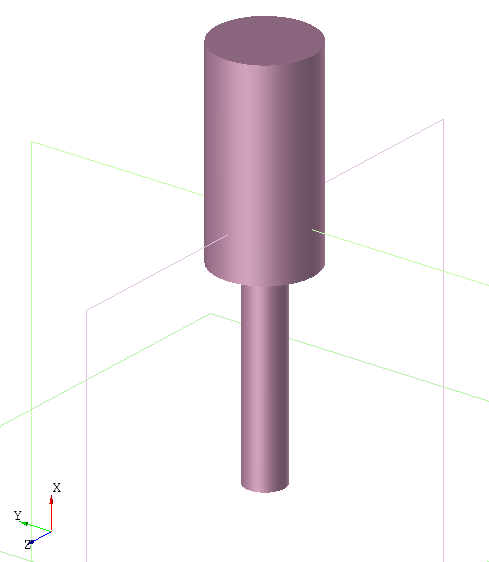
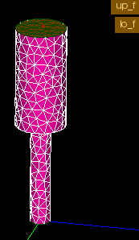
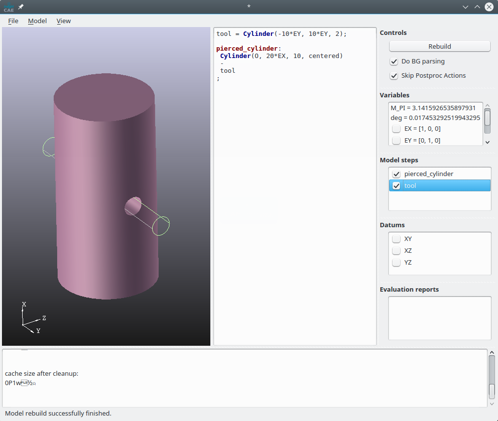
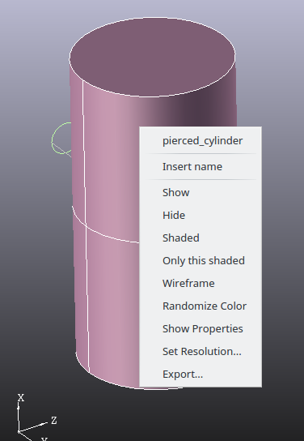
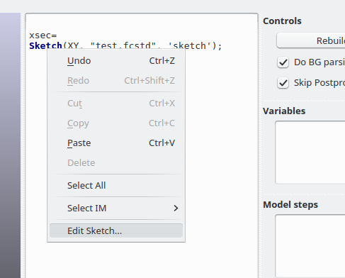
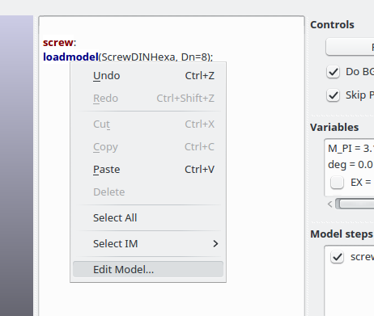

# Introduction

InsightCAD is a script-based tool for creating three-dimensional geometry models. All geometric operations are based on the OpenCASCADE geometry kernel. It uses the boundary representation approach (BREP) for treating the geometry. Thus it is possible to import and export the common exchange formats IGES and STEP.

Although the primary intention of InsightCAD is creation of fully parameterized CAD models for systematic numerical simulations, it can also be used for mechanical design purposes. It therefore provides the possibility to export projections and sections of the created models in DXF format for use in drawings. Additionally, there is support for a library of parametric standard parts.

# Basic Concept

The basic entity in InsightCAD is a "model". A model is described by a script and stored in an ASCII script file (extension ".iscad"). Inside a model script, symbols are defined, which can represent the following data types:

-   Scalars

-   Vectors

-   Datum objects (axes, planes)

-   3D geometry objects (features)

-   Selections of vertices, edges, faces or solids of 3D geometry objects

There is no explicit type declaration: the data type of each symbol is deduced from the defining expression.

Beyond their geometry representation, geometry feature objects are containers for scalar, vector, datum and feature objects. These symbols can be accessed in the model script but are read-only.

In a model script, after the definition of the aforementioned symbols, an optional section with postprocessing actions can follow. These can be e.g. file export, drawing export or others.

### General CAD Model Script Syntax

The general model script layout begins with a mandatory symbol defining section, followed by an optional postprocessing section, started by "@post":

```cpp
<identifier> [ = | ?= | : ] <expression>;
...

@post

<postprocessing action>;
...
```

Comments are lines starting with "#" or text regions enclosed by "/\*" and "\*/" (C-style).

# Submodels and Subassemblies

It is possible to load another model into the current one by the "loadmodel" command (see section "Features"). In this case, the loaded model represents a subassembly, i.e. a compound of features. Since not all defined geometry objects in the submodel may represent assembly components, marking of components is supported by the feature definition syntax and needs to be utilized properly in the definition script of the submodel. Also, when loading models (subassemblies), parameters can be passed to the submodel. These can be scalars, vectors, datums or features.

# Symbol Definition

## Scalars

Example:

```cpp
D ?= 123.5;
L = 2.*D;
```

The "?=" operator assigns a default value. This needs to be used for symbols which are intended to be used as parameters in the "loadmodel" feature command. Symbols defined by the equal sign operator ("=") cannot be overridden during the loadmodel command.

Supported operations are listed in table [3](#tab:iscad_algebra).

| InsightCAD script | Description |
|---|---|
| `+ - * /` | basic algebra |
| `mag(<vector>)` | magnitude of vector |
| `sqrt(<scalar>)` | square root |
| `sin(<scalar>)` | sin(x) |
| `cos(<scalar>)` | cos(x) |
| `tan(<scalar>)` | tan(x) |
| `asin(<scalar>)` | arcsin(x) |
| `acos(<scalar>)` | arccos(x) |
| `ceil(<scalar>)` | smallest following integer |
| `floor(<scalar>)` | largest previous integer |
| `round(<scalar>)` | round to next integer |
| `pow(<scalar:a>, <scalar:n>)` | a^n |
| `atan2(<scalar:y>, <scalar:x>)` | arctan(y/x) |
| `atan(<scalar>)` | arctan(x) |
| `volume(<feature>)` | volume of feature |
| `cumedgelen(<feature>)` | sum of all edges lengths |
| `<vector>.x` | x component of vector |
| `<vector>.y` | y component of vector |
| `<vector>.z` | z component of vector |
| `<feature>$<identifier>` | scalar property of feature |
| `<vector> & <vector>` | Scalar product |

**Table:** Algebraic operations in ISCAD scripts {#tab:iscad_algebra}

There are scalars predefined in each model. They are included in table [6](#tab:iscad_datums).

## Vectors

Example:

```cpp
v ?= 5*EX + 3*EY + [0,0,1];
ev = v/mag(v);
```

The "?=" operator assigns a default value. This needs to be used for symbols which are intended to be used as parameters in the "loadmodel" feature command. Symbols defined by the equal sign operator ("=") cannot be overridden during the loadmodel command.

Supported operations are listed in table [4](#tab:iscad_vectorOps).

| InsightCAD script | Description |
|---|---|
| `+ -` | basic algebra |
| `[<x>, <y>, <z>]` | vector from components |
| `<feature>@<vector>` | vector property of feature |
| `<scalar>*<vector>` | scaled vector |
| `<vector>/<scalar>` | scaled vector |
| `<vector:a>^<vector:b>` | Cross product a × b |
| `bbmin(<feature>)` | minimum corner of feature bounding box |
| `bbmax(<feature>)` | maximum corner of feature bounding box |
| `cog(<feature>)` | center of gravity coordinates of feature |
| `refpt(<datum>)` | reference point of datum (base point of axis or plane) |
| `refdir(<datum>)` | reference direction of datum (direction of axis or normal of plane) |

**Table:** Vector operations and functions in ISCAD scripts {#tab:iscad_vectorOps}

There are vectors predefined in each model. They are included in table [6](#tab:iscad_datums).

## Datums

Some simple examples are given below.

```cpp
myaxis   ?= RefAxis(O, EX+EY); # diagonal axis
myplane  = Plane(5*EX, EY);  # offset plane
myplane2 = XZ << 5*EX; # same offset plane
axis2    = xsec_plpl(XY, myplane); # axis at intersection of XY-Plane and offset plane
```

The "?=" operator assigns a default value. This needs to be used for symbols which are intended to be used as parameters in the "loadmodel" feature command. Symbols defined by the equal sign operator ("=") cannot be overridden during the loadmodel command.

Supported operations are listed in table [5](#tab:iscad_datumOps).

| InsightCAD script | Description |
|---|---|
| `<feature>%<identifier>` | Access datum inside another feature. |
| `<datum> << <vector:Δ>` | Copy of datum, translated by Δ |
| `Plane(<vector:p0>, <vector:n>)` | Datum plane with origin p0 and normal n. |
| `SPlane(<vector:p0>, <vector:n>, <vector:e_up>)` | Additionally, the y-direction of the plane CS is aligned with e_up. |
| `RefAxis(<vector:p0>, <vector:e_x>)` | Axis with origin p0 and direction e_x. |
| `xsec_axpl(<datum:ax>, <datum:pl>)` | Datum point at intersection between axis ax and plane pl |
| `xsec_plpl(<datum:pl1>, <datum:pl2>)` | Datum axis at intersection between plane pl1 and pl2 |
| `xsec_ppp(<datum:pl1>, <datum:pl2>, <datum:pl3>)` | Datum point at intersection between three planes |

**Table:** Datum operations and functions in ISCAD scripts {#tab:iscad_datumOps}

There are datums predefined in each model. They are listed in table [6](#tab:iscad_datums).

| InsightCAD script | Description |
|---|---|
| `M_PI` | π |
| `deg` | Conversion factor from degrees to radians (180/π) |
| `EX` | Unit vector in X direction (1 0 0)^T |
| `EY` | Unit vector in Y direction (0 1 0)^T |
| `EZ` | Unit vector in Z direction (0 0 1)^T |
| `O` | Origin (0 0 0)^T |
| `XY` | X-Y-Plane |
| `XZ` | X-Z-Plane |
| `YZ` | Y-Z-Plane |

**Table:** Predefined symbols (scalars, vectors and datums) in ISCAD scripts {#tab:iscad_datums}

## Features

A very simple example is given below. It consists of two primitive features (cylinder) and a boolean operation (subtraction).

```cpp
tool = Cylinder(-10*EY, 10*EY, 2);

pierced_cylinder:
Cylinder(O, 20*EX, 10, centered)
-
tool;
```

Geometry symbols can be defined by a "=" or a ":" operator. The difference comes from a possible use of the model as a subassembly later on. Since usually not all defined features in a model are assembly components but some are only intermediate modeling steps, there are these two syntaxes for defining a feature with a subtle difference: "<identifier> = <expression>;" defines an intermediate feature while "<identifier>: <expression>;" does the same geometry operation but marks the result as being an assembly component. In the above example, only the feature "pierced_cylinder" is marked as a component. Thus if the above example would be loaded as a subassembly, only the "pierced_cylinder" will be shown and included in e.g. mass calculations.

| InsightCAD script | Description |
|---|---|
| `<feature:a> - <feature:b>` | Boolean subtract of feature b from feature a |
| `<feature:a> \| <feature:b>` | Boolean unite of feature a and feature b |
| `<feature:a> & <feature:b>` | Boolean intersection of feature a and feature b |
| `<feature> << <vector:delta>` | Copy of feature, translated by vector delta |
| `<feature> * <scalar:s>` | Copy of feature, scaled by s (relative to global origin O) |
| `<feature>.<identifier:subfeatname>` | Access of subfeature |

**Table:** Feature operations in ISCAD scripts {#tab:iscad_datum}

# Feature Commands

In this section, an incomplete subset of the avilable feature commands is described in detail. For a complete list, please refer to the online documentation in the iscad editor (press Ctrl+F).

## Transformation

`Transform(<feature:f>, <vector:delta>, <vector:phi>)`

Transformation of feature f. Translation by vector delta and rotation around axis vector phi (magnitude of phi gives rotation angle).

`Place(<feature:f>, <vector:p_0>, <vector:e_x>, <vector:e_z>)`

Places the feature f in a new coordinate system. The new origin is at point p_0, the new x-axis along vector e_x and the new z-direction is e_z.

## Import

`import(<path>)`

Imports solid geometry from a file. The format is recognized from the filename extension. Supported formats are IGS, STP, BREP.

`Sketch(<datum:pl>, <path:file>, <string:name> [, <identifier>=<scalar>, ... ])`

Reads a sketch (i.e. a singly closed contour) from a file. The geometry in the sketch is expected to be drawn in the X-Y-Plane. It is placed on the given plane pl. Sketch file format is recognized from the file name extension. Supported are ".dxf" and ".fcstd" (FreeCAD). The name is interpreted as layer name in DXF and sketch name in FreeCAD files.

For FreeCAD sketches, a list of parameter values can optionally be supplied. Upon loading, the sketch will be regenerated through FreeCAD with these values.

`loadmodel( <identifier:modelname> [, <identifier> = `<`feature`>|<`datum`>|` `<`vector`>|<`scalar`>`, ... ] )`

Parses another InsightCAD model (submodel) and inserts a compound of all features into the current model, which were marked as components in the submodel (i.e. which were defined with the colon ":" operator instead of the equal sign "=" in the submodel).

The model filename has to be "<modelname>.iscad". It is searched for in the following directories:

1.  the directories listed in the environment variable "ISCAD_MODEL_PATH" (separated by ":")

2.  the subdirectory "iscad-library" in InsightCAEs shared file directory

3.  in the current directory

Optionally, a list of symbols is inserted into the namespace of the submodel (additional optional parameters).

## Geometry Construction

### Primitives

There are commands for creation of several different geometrical primitives, e.g.

-   1D: Arc, Line, SplineCurve

-   2D: Quad, Tri (triangle), RegPoly (regular polygon), Circle, SplineSurface

-   3D: Sphere, Cylinder, Box, Bar, Cone, Pyramid, Torus

`Extrusion(<feature:f>, <vector:L> [, centered ] )`

Extrude the feature f with direction and length vector L. When the keyword "centered" is given, the extrusion is centered around f.

`Revolution( <feature:f>, <vector:p_0>, <vector:axis>, <scalar:phi> [, centered] )`

Creates a revolution of the planar feature f. The rotation axis is specified by origin point p_0 and the direction vector axis. Revolution angle is specified by phi. By giving the keyword "centered", the revolution is created symmetrically around the base feature.

### Other Feature Commands

There are more features available. A comprehensive list is obtained by pressing Ctrl+F in the iscad editor.

# Lower Dimensional Shape Selection

ISCAD supports rule based selection of lower dimensional features (i.e. edges or faces of a solid). The selection is generated by a selection command: a question mark, followed by the type of shape to query. The result is a selection object:

```cpp
<feature expression|feature selection>?(vertices|edges|faces|solids);('<command string>' [, parameter 0 [, ..., parameter n] ] )
```

It is possible to supply additional arguments to the selection expression, like scalars, vectors or features.

An example: the following expression selects the circumferential face of the cylinder c (all faces, which are not plane) and stores the selection in "shell_faces":

```cpp
c = Cylinder(O, 5*EZ);
shell_face = c ? faces('!isPlane');
min_end_face = c ? faces('isPlane && minimal(CoG.z)');
```

The selection command string contains rules for the selection. Finally, the command string is evaluated as a boolean expression comprising comparison operators, boolean operators and query functions. Within these boolean expressions, quantity functions can be used. The available set of query functions and quantity functions depends on the type of shape which shall be queried.

Boolean expressions available for all kinds of lower dimensional shapes are listed in table [8](#tab:iscad_feat_general_bool).

Quantity functions available for all kinds of lower dimensional shapes are listed in table [9](#tab:iscad_feat_general_qty).

| Command | Description |
|---|---|
| `==, <, >, >=, <=` | value comparison |
| `!` | not |
| `&&` | and |
| `\|\|` | or |
| `<value 1> ~ <value 2> { <tolerance> }` | approximate equality |
| `in(<selection set>)` | true if shape is in other selection |
| `maximal(<quantity>)` | true for the shape with maximum quantity |
| `minimal(<quantity>)` | true for the shape with minimum quantity |

**Table:** General boolean functions and operators available for all kinds of lower dimensional shape {#tab:iscad_feat_general_bool}

| Command | Description |
|---|---|
| `angleMag(<vec 1>, <vec 2>)` | angle between vec 1 and vec 2 |
| `angle(<vec 1>, <vec 2>)` | angle between vec 1 and vec 2 |
| `%d<index>` | parameter \<index\> as scalar |
| `%m<index>` | parameter \<index\> as vector |
| `%<index>` | parameter \<index\> as selection set |

**Table:** General quantity functions available for all kinds of lower dimensional shape {#tab:iscad_feat_general_qty}

## Vertices

There are no special boolean functions or operators for vertices.

The available quantity functions for vertices are listed in table [10](#tab:iscad_feat_vertex_qty).

| Command | Description |
|---|---|
| `loc` | location of the vertex |

**Table:** Quantity functions available for vertex selections {#tab:iscad_feat_vertex_qty}

## Edges

Boolean functions for edges are listed in table [11](#tab:iscad_feat_edges_bool).

The available quantity functions for edges are listed in table [12](#tab:iscad_feat_edges_qty).

| Command | Description |
|---|---|
| `isLine` | true, if edge is straight |
| `isCircle` | true, if edge is circular |
| `isEllipse` | true, if edge is elliptical |
| `isHyperbola` | true, if edge is on a hyperbola |
| `isParabola` | true, if edge is on a parabola |
| `isBezierCurve` | true, if edge is a bezier curve |
| `isBSplineCurve` | true, if edge is a BSpline curve |
| `isOtherCurve` | true, if edge is none of the above |
| `isFaceBoundary` | true, if edge is boundary of some face |
| `boundaryOfFace(<set>)` | true, if edge is boundary of one of the faces in set |
| `isPartOfSolid(<set>)` | true, if edge is part of one of the solids in set |
| `isCoincident(<set>)` | true, if edge is coincident with one of the edges in set |
| `isIdentical(<set>)` | true, if edge is identical with one of the edges in set |
| `projectionIsCoincident(<set>, <vec:p0>, <vec:n>, <vec:up>, <scalar:tol>)` | true, if projection of edge is coincident with some edge in set |

**Table:** Boolean functions available for edge selections {#tab:iscad_feat_edges_bool}

| Command | Description |
|---|---|
| `len` | length of edge |
| `radialLen(<vec:ax>, <vec:p0>)` | radial distance between ends with respect to axis (p0,ax) |
| `CoG` | center of gravity of edge |
| `start` | start point coordinates |
| `end` | end point coordinates |

**Table:** Quantity functions available for edge selections {#tab:iscad_feat_edges_qty}

## Faces

Boolean functions for faces are listed in table [13](#tab:iscad_feat_faces_bool).

The available quantity functions for faces are listed in table [14](#tab:iscad_feat_faces_qty).

| Command | Description |
|---|---|
| `isPlane` | true, if is a plane |
| `isCylinder` | true, if is a cylindrical surface |
| `isCone` | true, if is a conical surface |
| `isSphere` | true, if is a spherical surface |
| `isTorus` | true, if is a toroidal surface |
| `isBezierSurface` | true, if is a bezier surface |
| `isBSplineSurface` | true, if is a BSpline surface |
| `isSurfaceOfRevolution` | true, if is a surface of revolution |
| `isSurfaceOfExtrusion` | true, if is a surface of extrusion |
| `isOffsetSurface` | true, if is a offset surface |
| `isOtherSurface` | true, if is some other kind of surface |
| `isPartOfSolid(<set>)` | |
| `isCoincident(<set>)` | |
| `isIdentical(<set>)` | |
| `adjacentToEdges(<set>)` | |
| `adjacentToFaces(<set>)` | |

**Table:** General boolean functions available for face selections {#tab:iscad_feat_faces_bool}

| Command | Description |
|---|---|
| `area` | area of the face |
| `CoG` | center of gravity of the face |
| `cylRadius` | radius of a cylindrical face |
| `cylAxis` | axis direction of a cylindrical face |

**Table:** Quantity functions available for face selections {#tab:iscad_feat_faces_qty}

## Solids

There are no special boolean functions or operators for solids.

The available quantity functions for solids are listed in table [15](#tab:iscad_feat_solids_qty).

| Command | Description |
|---|---|
| `CoG` | center of gravity |
| `volume` | volume of the solid |

**Table:** Quantity functions available for solid selections {#tab:iscad_feat_solids_qty}

# Postprocessing Actions

## Drawing Export

`DXF(<path:outputfile>) <<`` `` <feature:f> <view_definition> [, <view_definition>, ... ]`

The DXF postprocessing action creates a DXF file for further use in drawings. Several views are derived from the feature f. A <view_definition> takes the following form:

```cpp
<identifier:viewname> (
 <vector:p_0>, <vector:n>, up <vector:e_up>
  [, section]
  [, poly]
  [, skiphl]
  [, add [l] [r] [t] [b] [k] ]
  )
```

It defines a view on the point vector p_0 with normal direction vector n of the view plane. The upward direction (Y-direction) is aligned with vector e_up.

The keyword "section" toggles whether only the outline is projected or if the view plane creates a section through the geometry.

If keyword "poly" is given, the DXF geometry will be discretized. This is more robust but creates much larger DXF files.

Keyword "skiphl" toggles whether hidden lines are output.

The keyword "add" followed by the key letters l, r, t, b and/or k enables creation of additional projections from the left, right, top, bottom and/or back, respectively.

An example is given below:

```cpp
c: Cylinder(O, 100*EX, 20);

@post

DXF("c.dxf") << c
     top ( O, EX, up EY )
     front ( O, EZ, up EY )
;
```

## Mesh Creation

`gmsh(<path:outputfile>) <<`` <feature:f> as <identifier:l> `<`mesh_parameters`>

Generates a (triangular or tetrahedral) mesh for an FEA analysis of the feature f. Gmsh is used as a meshing backend. The mesh format is determined by the outputfile extension (.med = MED format). The label of the mesh is set to l.

The syntax of the <mesh_parameters> are as follows:

```cpp
L = ( <scalar:Lmax> <scalar:Lmin> )
 [linear]
 vertexGroups( [ <identifier:group name> = <vertex set> [ @ <scalar:size> ], ... ] )
 edgeGroups( [ <identifier:group name> = <edge set> [ @ <scalar:size> ], ... ] )
 faceGroups( [ <identifier:group name> = <face set> [ @ <scalar:size> ], ... ] )
 [ vertices ( [ <identifier:vertex name> = <vector:location> ], ... ) ]
```

The general mesh size is set by Lmax and Lmin. The optional keyword "linear" switch from quadratic to linear elements. Named groups of vertices, edges and faces can be created using the keywords "vertexGroups", "edgeGroups" and "faceGroups" repectively. Each group definition takes the form "groupname" = "selection set" (see section "Lower dimensional shape selection" for definition of selection sets). Optionally, a mesh size can be assigned to each defined group by appending an @ sign followed by a scalar value.

An example is given below:

```cpp
c:
Cylinder(O, 100*EX, 20)
 |
Cylinder(100*EX, ax 100*EX, 50)
;

@post

gmsh("c.med") << c as cyl
     L = (10 0.1)
     linear
     vertexGroups()
     edgeGroups()
     faceGroups(
      lo_f = c?faces('isPlane&&minimal(CoG.x)')
      up_f = c?faces('isPlane&&maximal(CoG.x)')
     )
;
```

Result: ISCAD model (left) and resulting mesh (right):

{width="45%"}
{width="45%"}

# Graphical Editor ISCAD

ISCAD is a graphical editor for InsightCAD scripts. It consists of a text editor for editing the script contents and a 3D view and some other elements for inspecting the resulting model. A screenshot is shown in the figure below.

The model script is entered into the text editor widget right of the 3D display. Once a script shall be evaluated, it can be parsed by clicking in the button "Rebuild" or pressing Ctrl+Return.

After parsing the model, the following results are displayed:

-   A list of all created feature symbols in the "Model Steps" list box. If the check box is checked, the 3D geometry is displayed in the 3D view.

-   The values of all scalars and vectors in the "Variables" list box.

    For each vector variable, a check box is displayed. If it is checked, the vector is interpreted as a point location and the point is shown in the 3D display window.

-   All defined datums are listed in the "Datums" list box. Again, the check box controls, whether the datum is displayed in the 3D view.

{width="100%"}

## 3D Graphics Display

### View Manipulation

-   Dragging: Shift + mouse move

-   Scaling: Ctrl + horizontal mouse move

-   Rotating: Alt + mouse move

### Model Navigation

When hoovering the mouse pointer over a displayed feature in the 3D geometry window, it is highlighted. The highlighted feature is the one, which would be selected during subsequent mouse clicks.

When the left mouse button is pressed, the highlighted feature is selected and all its contained reference points are displayed.

When the right mouse button is pressed, a context menu for the selected feature is displayed.

{width="33%"}

The context menu provides these functions:

-   The first entry is the feature name. When it is selected, the definition in the script editor is highlighted and the cursor jumps to it.

-   "Insert name": inserts the name of the feature symbol at the cursor location

-   "Export\...": Export the feature geometry to a file (BREP, STP, IGES, STL)

## Text Editor

When script code is entered into the text editor window, it is parsed in the background. Once this has been done successfully, some extensions of the context menu is available:

-   Context menu on "Sketch" command:

    {width="33%"}

    When selecting the "Edit Sketch\..." entry, FreeCAD is launched and the sketch editor opened. If the FreeCAD-file or sketch inside it is not yet existing, they are created.

-   Context menu on "loadmodel" command:

    {width="33%"}

    When selecting the "Edit Model\..." entry, another instance of iscad is launched with the specified model script loaded.
