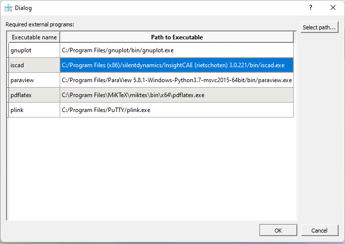
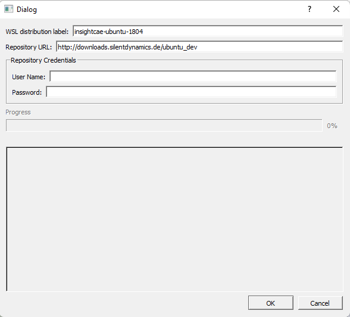
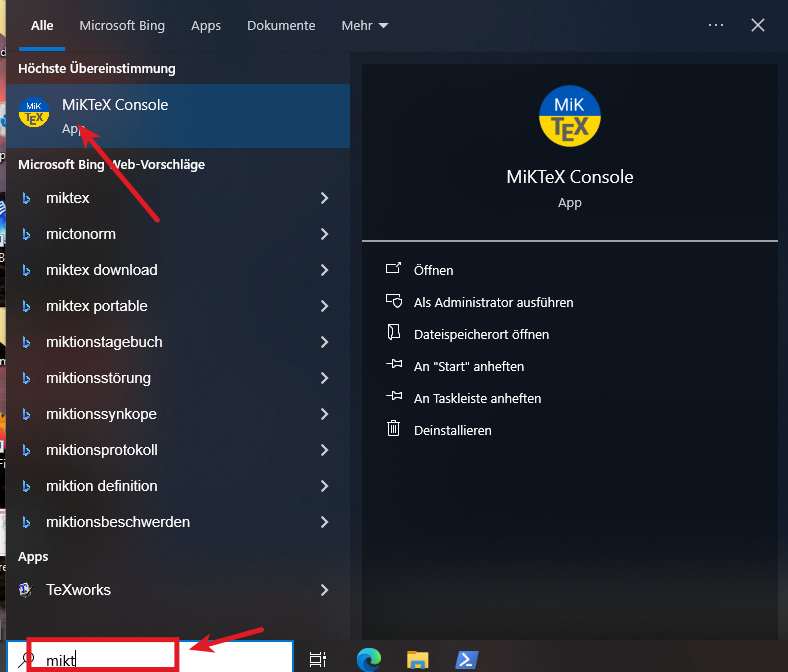
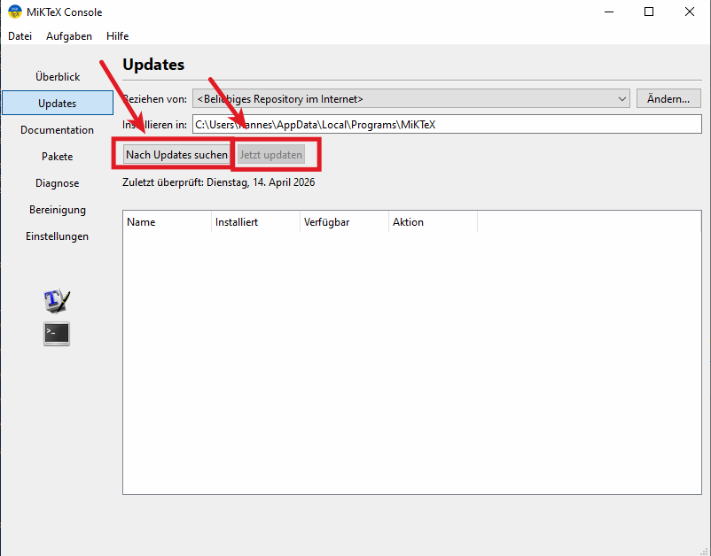

# Installation on Windows

InsightCAE and its backend tools (OpenFOAM, Code_Aster) are Linux software. They can
nevertheless be run on Windows 10 (64-bit) or later via the _Windows Subsystem for Linux_
(WSL). No virtualization is used — processes share memory with Windows processes and files
are stored in the Windows file system.

Because graphical output from WSL is unreliable, the software is split into:

- a **frontend** that runs natively on Windows, and
- a **backend** that controls the solvers and runs inside WSL.

Communication between both sides uses the network stack.

## Installer

A ready-to-use installer is provided. Download the latest `InsightCAEInstaller-X.Y.Z.exe`
from one of these locations:

| Version | URL |
|---|---|
| Stable (_master_ branch) | `http://downloads.silentdynamics.de/ubuntu/` |

!!! note "Customer installations"
    For supported customer deployments the installer is downloaded from a dedicated
    repository URL provided by silentdynamics.

The installer:

- activates the Windows Subsystem for Linux if not already active,
- bundles required third-party programs: ParaView, gnuplot, MiKTeX, PuTTY.

!!! warning "Python runtime required"
    The Python runtime library (`python36.dll`) must be in the `PATH` environment
    variable. Enable the option _"Add Python to PATH"_ during Python installation.
    If this was missed, `PATH` must be edited manually after installation.

!!! note
    Administrator rights are required for installation.

## First Launch

After installation, reboot the system and launch the InsightCAE **Workbench** from the
Start Menu. On first launch two setup steps are required:

### 1. Set Paths to Executables

Some required executables are not in the system `PATH`. The configuration dialog shown
below is displayed for each missing executable.

Click on a row without a path, then click _Select path..._ and locate the executable.

### 2. Verify or Create the WSL Backend

The installer includes a WSL image matching the installer version. This check should
succeed silently for a fresh installation.

If no WSL backend is found, a prompt appears. Click _Create_ to open the creation form:

The URL is preset from the source from which the installer was downloaded. Support
customers must enter their credentials in the appropriate fields. Click _Ok_ to download
and install the backend image (~1.5 GB). Once complete, the Workbench GUI opens.

## Updating

Download the newer installer from the same location and run it. In the installation
wizard only the last two components need to be selected:

- **WSL Distribution**
- **InsightCAE Windows Client**

Skip third-party tools if they were already installed previously.

### Updating MiKTeX

MiKTeX is used by InsightCAE for generating PDF reports and rendering charts. It is
updated independently:

1. Open the MiKTeX Console (press the Windows key and type _miktex console_).

    

2. Switch to the _Updates_ tab, click _Search for Updates_, then click _Update Now_.

    
